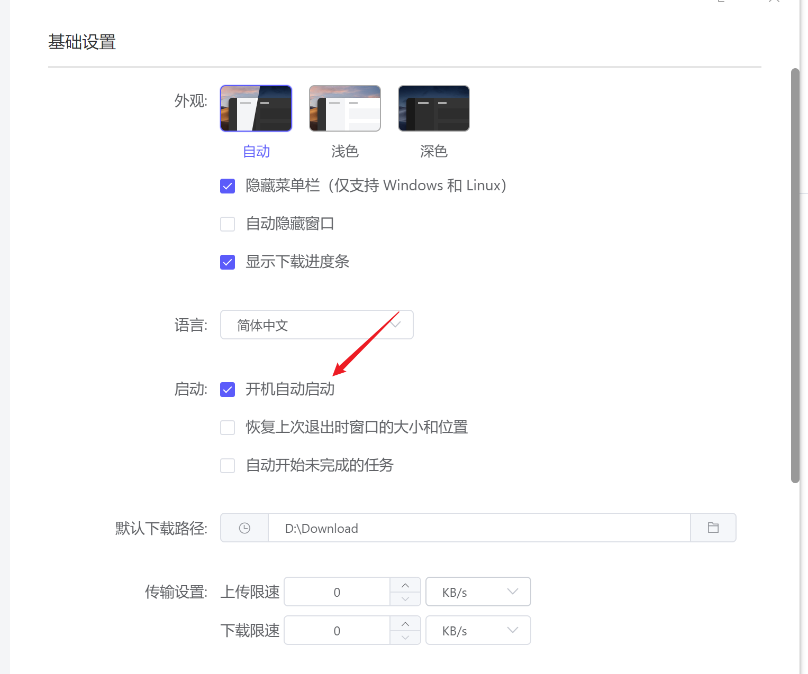
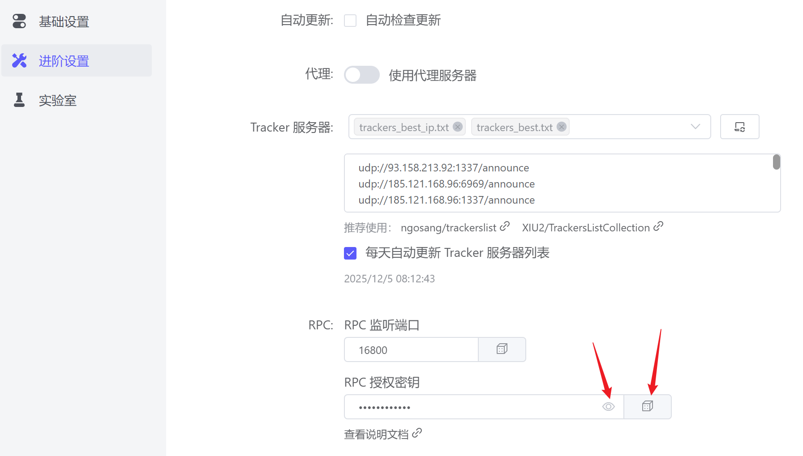
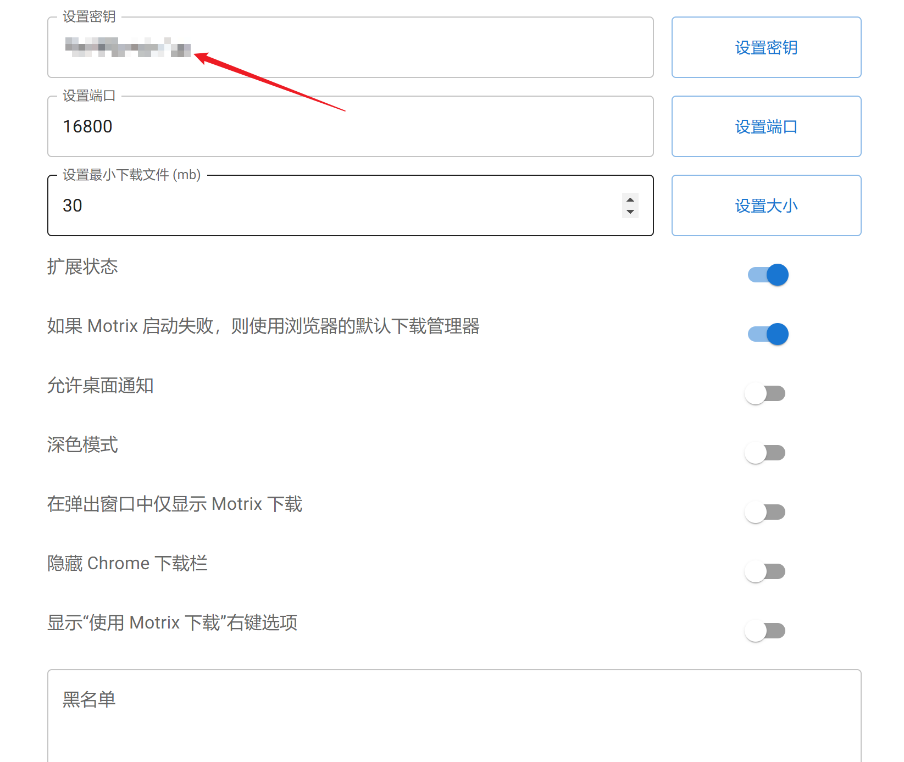

## UC网盘下载提速以及网页直接下载
UC网盘的分享链接一般是https://drive.uc.cn/s/kfcv50  
你只需要把drive改成fast即可直接下载，不用下载UC浏览器  
但是不用多线程下载器速度会很慢，下面是启用Motrix多线程下载器接管浏览器自带的办法  
## 启用Motrix多线程下载器（这里是百分浏览器，类似Chrome）
1. 前往官网下载你需要的软件版本然后安装，网址：https://motrix.app/download

2. 安装好后打开开机自启动，然后前往进阶设置随机一下密钥，戳开眼睛复制待用

4. 打开https://www.crxsoso.com/  搜索Motrix，安装插件，然后在浏览器点开，绿色启用

5. 打开安装好的插件设置，填入刚刚设置的密钥，然后点击右边设置密钥，之后你浏览器的下载就会被Motrix接管

## 视频教程
<!-- 视频容器 -->

  <!-- 视频播放器 -->
  

    <iframe 
      src="//player.bilibili.com/player.html?isOutside=true&aid=115666875063584&bvid=BV15P2EBxEGi&cid=34526266593&p=1&autoplay=false" 
      scrolling="no" 
      frameborder="no" 
      framespacing="0" 
      allowfullscreen="true"
      style="position: absolute; top: 0; left: 0; width: 100%; height: 100%;">
    </iframe>
  

  
  <!-- 跳转按钮 -->
  

    <a 
      href="https://www.bilibili.com/video/BV15P2EBxEGi" 
      target="_blank" 
      style="display: inline-block; padding: 8px 16px; background: #00aeec; color: white; text-decoration: none; border-radius: 4px; font-size: 14px;">
      去哔哩哔哩观看ヾ(•ω•`)o
    </a>
  

